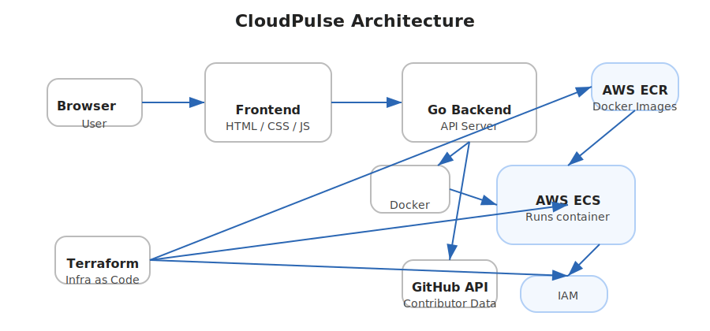
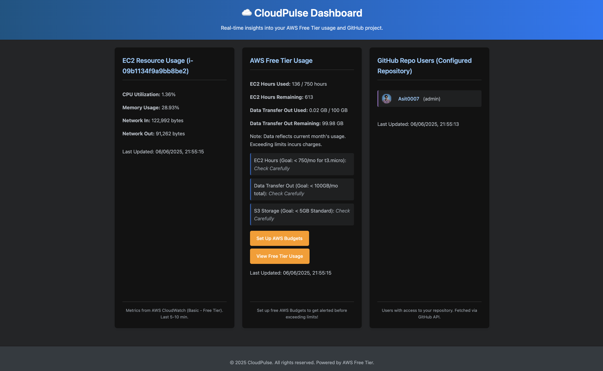
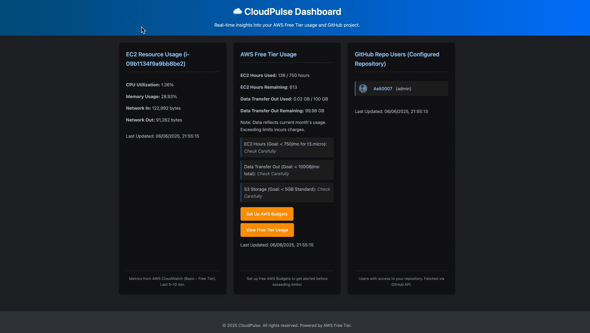

<h1 align="center">☁️ CloudPulse</h1>

<p align="center">
  <b>Production-grade AWS monitoring dashboard built with Go, Docker, Terraform, and GitHub Actions</b><br>
  <i>A full DevOps project — from local development to cloud deployment with IaC, secrets management, and observability.</i>
  <br><br>
  <a href="https://github.com/Asit0007/CloudPulse/actions/workflows/deploy.yml">
    
  </a>
  <a href="https://github.com/Asit0007/CloudPulse/blob/main/LICENSE">
    
  </a>
  <a href="https://github.com/Asit0007/CloudPulse" target="_blank">
    
  </a>
  
  
  
  
</p>

---

## What This Project Demonstrates

CloudPulse is an end-to-end DevOps project built to practice and showcase real-world engineering workflows. It is not a tutorial follow-along — every component was designed, broken, debugged, and shipped independently.

| Domain                     | Tools & Practices                                            |
| -------------------------- | ------------------------------------------------------------ |
| **Backend Development**    | Go REST API, AWS SDK v2, GitHub API v3, OAuth2               |
| **Infrastructure as Code** | Terraform (ECS, ECR, IAM, Security Groups, VPC)              |
| **Secrets Management**     | HashiCorp Vault (KV v2), Docker Compose local dev            |
| **CI/CD Pipeline**         | GitHub Actions (build → push to ECR → deploy to EC2/ECS)     |
| **Containerization**       | Multi-stage Docker builds, Docker Hub + AWS ECR              |
| **Observability**          | Prometheus metrics endpoint, Grafana dashboards, CloudWatch  |
| **Cloud Deployment**       | AWS ECS Fargate, EC2, ECR, IAM least-privilege policies      |
| **Security**               | IAM roles, environment-based secrets, `.gitignore` hardening |

---

## Architecture



> See [docs/ARCHITECTURE.md](docs/ARCHITECTURE.md) for a full component breakdown and data flow.

### Key Design Decisions

- **Go backend** chosen for its low memory footprint and suitability for containerized environments — important when targeting AWS Free Tier limits.
- **Vault for secrets** instead of plain environment variables, demonstrating production-like secret lifecycle management (init, unseal, KV engine, policy-scoped tokens).
- **Terraform over ClickOps** — all AWS infrastructure (ECS cluster, task definition, IAM roles, ECR repo, security groups) is reproducible and version-controlled.
- **GitHub Actions pipeline** triggers on push to `main`, builds a Docker image, pushes to ECR, and redeploys the ECS task — zero manual deployment steps.
- **Prometheus integration** exposes a `/metrics` endpoint scraped by a local Prometheus + Grafana stack for observability beyond CloudWatch.

---

## Live Dashboard

<p align="center">
  
  <br><i>Real-time EC2 metrics, Free Tier usage tracking, and GitHub contributor data.</i>
</p>

<p align="center">
  
</p>

---

## Tech Stack

```
Backend:       Go 1.21+  ·  AWS SDK v2  ·  GitHub API v3  ·  HashiCorp Vault SDK
Frontend:      HTML5  ·  CSS3  ·  Vanilla JS (no framework overhead)
Infrastructure: Terraform 1.5+  ·  AWS ECS Fargate  ·  AWS ECR  ·  AWS CloudWatch
Observability: Prometheus  ·  Grafana
Secrets:       HashiCorp Vault (KV v2, policy-scoped tokens)
CI/CD:         GitHub Actions  ·  Docker  ·  Docker Hub  ·  AWS ECR
```

---

## Project Structure

```
CloudPulse/
├── backend/
│   ├── main.go          # Go API server — CloudWatch, GitHub, Vault integrations
│   ├── go.mod / go.sum  # Dependency management
│   └── Dockerfile       # Multi-stage build
├── frontend/
│   ├── index.html       # Dashboard UI
│   ├── styles.css       # Responsive styling
│   ├── script.js        # Async data fetching and DOM updates
│   └── offline.html     # Graceful degradation page
├── terraform/
│   ├── main.tf          # ECS, ECR, IAM, VPC, Security Groups
│   └── variables.tf     # Parameterized configuration
├── docs/
│   ├── ARCHITECTURE.md  # Component and data flow documentation
│   └── assets/          # Architecture diagram, screenshots
└── .github/
    └── workflows/
        └── deploy.yml   # CI/CD: build → ECR push → ECS redeploy
```

---

## Prerequisites

- **Go 1.21+** — backend server
- **Docker** — local development and builds
- **Terraform 1.5+** — infrastructure provisioning
- **AWS CLI** — cloud interaction
- **HashiCorp Vault** — secrets management (local dev via Docker Compose)
- **GitHub Personal Access Token** — `repo` scope, for contributor data
- **AWS Account** — Free Tier compatible

---

## Getting Started

### 1. Clone

```bash
git clone https://github.com/Asit0007/CloudPulse.git
cd CloudPulse
```

### 2. Install Dependencies (macOS ARM64)

```bash
chmod +x install_dependencies.sh
./install_dependencies.sh
```

This installs Go, Docker, Terraform, AWS CLI, Node.js, Prometheus, and Grafana via Homebrew, and initializes Go modules with all required packages.

### 3. Start Vault Locally

```bash
# Start Vault dev server
docker compose up -d

# Initialize the KV engine and store secrets
export VAULT_ADDR=http://localhost:8200
export VAULT_TOKEN=root

vault secrets enable -path=kv kv-v2
vault kv put kv/cloudpulse \
  github_token=<your-github-pat>
```

### 4. Configure AWS

```bash
aws configure
# Enter: Access Key ID, Secret Access Key, region (us-east-1), output (json)
```

### 5. Run Locally

```bash
cd backend
docker build -t cloudpulse .
docker run -p 8080:8080 \
  -e VAULT_ADDR=http://host.docker.internal:8200 \
  -e VAULT_TOKEN=root \
  -e GITHUB_OWNER=<your-username> \
  -e GITHUB_REPO=CloudPulse \
  cloudpulse
```

Open [http://localhost:8080](http://localhost:8080)

---

## CI/CD Pipeline

```
Push to main
     │
     ▼
GitHub Actions
     ├── Checkout code
     ├── Build Docker image
     ├── Push to AWS ECR
     └── SSH to EC2 → pull new image → restart container
```

The pipeline uses GitHub Secrets for all credentials — no secrets are stored in the repository. Required secrets:

| Secret                                   | Description                    |
| ---------------------------------------- | ------------------------------ |
| `AWS_REGION`                             | e.g. `us-east-1`               |
| `DOCKERHUB_USERNAME` / `DOCKERHUB_TOKEN` | Docker Hub credentials         |
| `EC2_HOST_IP`                            | Public IP of your EC2 instance |
| `EC2_USERNAME`                           | SSH user (e.g. `ec2-user`)     |
| `EC2_SSH_PRIVATE_KEY`                    | Contents of your `.pem` file   |
| `GITHUB_OWNER`                           | Your GitHub username           |
| `GITHUB_REPO`                            | Repository name                |

---

## Infrastructure (Terraform)

All AWS resources are managed as code. No manual Console clicks required after initial setup.

```bash
cd terraform
terraform init
terraform validate
terraform plan -out=tfplan
terraform apply "tfplan"
```

Resources provisioned: ECS Cluster, ECS Task Definition, ECS Service, ECR Repository, IAM Roles and Policies (least privilege), Security Groups, VPC configuration.

---

## Observability

CloudPulse exposes a Prometheus-compatible `/metrics` endpoint. A local Prometheus + Grafana stack (configured in `prometheus.yml`) scrapes metrics across `testing`, `staging`, and `production` stages.

```bash
# Start Prometheus (after brew install prometheus)
prometheus --config.file=prometheus.yml

# Grafana available at http://localhost:3000
# Add Prometheus as a data source: http://localhost:9090
```

---

## Deployment to AWS

1. **Provision infrastructure:**

   ```bash
   cd terraform && terraform apply
   ```

2. **Push and deploy** — handled automatically by GitHub Actions on every push to `main`.

3. **Monitor:** EC2 metrics available in CloudWatch; application metrics in Prometheus/Grafana.

4. **Cost control:** Set up a $0 AWS Budget with an alert at $0.01.
   - [Create Budget](https://console.aws.amazon.com/billing/home#/budgets)
   - [View Free Tier Usage](https://console.aws.amazon.com/billing/home#/freetier)

---

## What I Learned / Challenges Solved

- **Vault unsealing in Docker**: Learned the difference between dev mode (auto-unseal) and production mode, and how to script the init → unseal → policy → token lifecycle.
- **EC2 metadata service**: IMDSv1 vs IMDSv2, timeout handling, and graceful fallback to `EC2_INSTANCE_ID_OVERRIDE` for local testing without real EC2.
- **CloudWatch custom metrics**: Basic monitoring doesn't include memory/disk — requires CloudWatch Agent installation and custom namespace (`CWAgent`). Implemented and documented the tradeoff.
- **GitHub Actions secrets vs environment variables**: Learned how secrets are masked in logs, scoped per environment, and passed securely to Docker containers.
- **Terraform state management**: Understood why `terraform.tfstate` must never be committed (contains resource IDs and may contain sensitive values), and set up proper `.gitignore` rules.

---

## Contributing

1. Fork the repository
2. Create a feature branch: `git checkout -b feature/your-feature`
3. Commit: `git commit -m "feat: describe your change"`
4. Push: `git push origin feature/your-feature`
5. Open a pull request

---

## Security

Sensitive files (`*.tfstate`, `*.tfvars`, `*.pem`, Vault scripts) are excluded via `.gitignore`. All secrets are managed through GitHub Secrets (CI/CD) and HashiCorp Vault (runtime). If you find a vulnerability, please open an issue or email [asitminz007@gmail.com](mailto:asitminz007@gmail.com).

---

## Community & Support

- **Issues**: [github.com/Asit0007/CloudPulse/issues](https://github.com/Asit0007/CloudPulse/issues)
- **Email**: [asitminz007@gmail.com](mailto:asitminz007@gmail.com)

---

## License

MIT License — see [LICENSE](LICENSE) for details.

---

## Further Reading

- [AWS ECS Documentation](https://docs.aws.amazon.com/ecs/)
- [Terraform AWS Provider](https://registry.terraform.io/providers/hashicorp/aws/latest/docs)
- [HashiCorp Vault KV Secrets](https://developer.hashicorp.com/vault/docs/secrets/kv/kv-v2)
- [GitHub Actions Documentation](https://docs.github.com/en/actions)
- [Prometheus Go Client](https://github.com/prometheus/client_golang)

---

<p align="center">
  <b>CloudPulse &copy; 2025 | Built with ❤️ for the DevOps community</b><br>
  <i>Designed to demonstrate real-world DevOps and Cloud Engineering practices</i>
</p>
