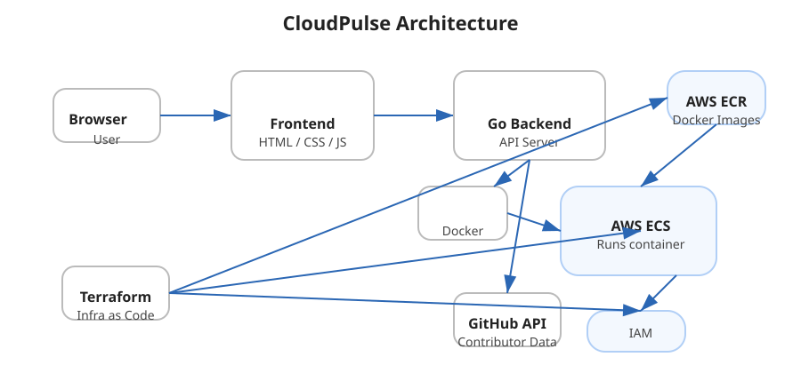
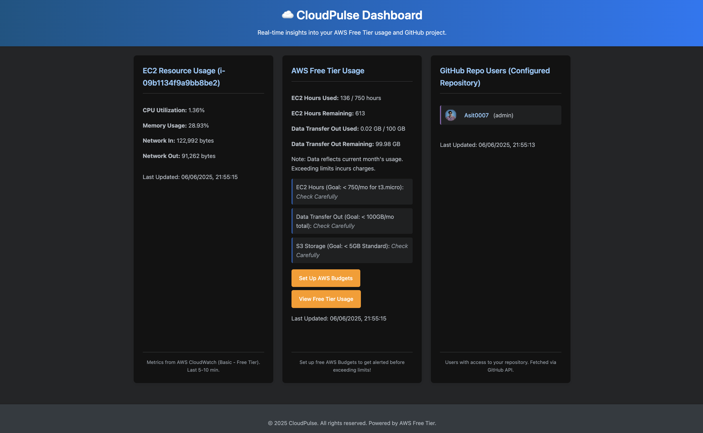
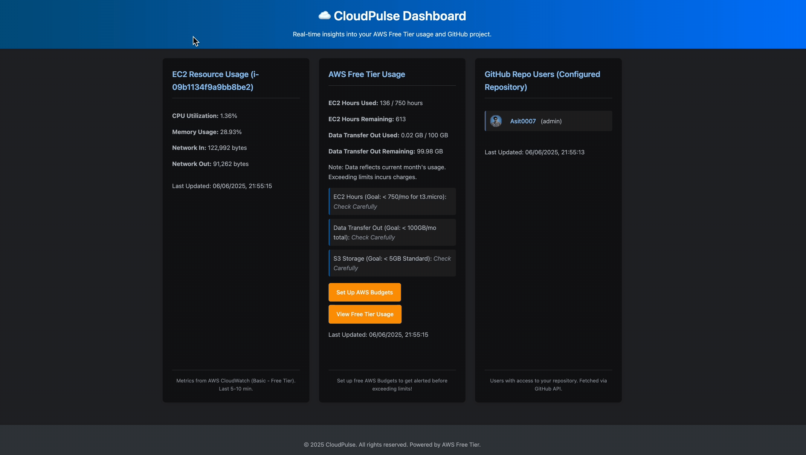

<h1 align="center">☁️ CloudPulse</h1>

<p align="center">
  <b>AWS Free Tier and GitHub monitoring dashboard built with Go, Docker, Terraform, and GitHub Actions</b><br>
  <i>A full DevOps project — from local development to cloud deployment with IaC, runtime secrets management, and CI/CD.</i>
  <br><br>
  <a href="https://github.com/Asit0007/CloudPulse/actions/workflows/deploy.yml">
    
  </a>
  <a href="https://github.com/Asit0007/CloudPulse/blob/main/LICENSE">
    
  </a>
  <a href="https://github.com/Asit0007/CloudPulse" target="_blank">
    
  </a>
  
  
  
  
</p>

---

> **Deployment status:** the AWS infrastructure for this project was **decommissioned on 2026-08-19** to keep the account at $0. The deploy workflow is therefore `workflow_dispatch`-only — the `push: main` trigger is commented out in [`.github/workflows/deploy.yml`](.github/workflows/deploy.yml) so it does not fail against a host that no longer exists. Everything below still describes how to stand it back up, and the app runs locally as documented.

---

## What This Project Demonstrates

CloudPulse is an end-to-end DevOps project built to practice and showcase real-world engineering workflows. It is not a tutorial follow-along — every component was designed, broken, debugged, and shipped independently.

| Domain                     | Tools & Practices                                                    |
| -------------------------- | -------------------------------------------------------------------- |
| **Backend Development**    | Go REST API (`net/http`, no framework), AWS SDK v2, GitHub API v3, OAuth2 |
| **Infrastructure as Code** | Terraform (EC2, IAM role/policy/instance profile, Security Groups, VPC data sources) |
| **Secrets Management**     | HashiCorp Vault (KV v2, policy-scoped tokens), Docker Compose local dev |
| **CI/CD Pipeline**         | GitHub Actions (build → push to Docker Hub → SSH deploy to EC2)      |
| **Containerization**       | Multi-stage Docker builds → statically-linked binary on Alpine       |
| **Observability**          | AWS CloudWatch metrics (`AWS/EC2` + `CWAgent` namespaces)            |
| **Cloud Deployment**       | Single AWS EC2 `t3.micro`, IAM instance profile, Free Tier constrained |
| **Cost Engineering**       | Terraform `validation` blocks that refuse to plan non-free-tier resources |
| **Security**               | IAM roles, runtime secret fetch from Vault, `.gitignore` hardening   |

---

## Architecture



CloudPulse is a **single Go binary** that serves both the JSON API and the static frontend from the same process and port. It runs as one Docker container on one EC2 instance, alongside a second container running Vault.

```
Internet ──:80──▶ EC2 t3.micro (default VPC, public subnet)
                   ├── docker: cloudpulse-app   -p 80:8080
                   │     ├──▶ AWS CloudWatch API  (creds via IAM instance profile)
                   │     └──▶ api.github.com      (PAT fetched from Vault at boot)
                   └── docker: vault-server      :8201  (file storage, KV v2)
```

> See [docs/ARCHITECTURE.md](docs/ARCHITECTURE.md) for a full component breakdown and data flow.

### Key Design Decisions

- **Go backend** chosen for its low memory footprint and suitability for containerized environments — important when targeting AWS Free Tier limits.
- **No router, no framework, no database** — raw `net/http` keeps the binary small and the dependency surface auditable. The app is stateless by design; every page load is a live passthrough query to AWS and GitHub.
- **Vault for secrets** instead of plain environment variables, demonstrating production-like secret lifecycle management (init, unseal, KV engine, policy-scoped tokens). The GitHub PAT is fetched at boot from `kv/cloudpulse`; AWS credentials come from the SDK credential chain (instance profile in production).
- **Terraform over ClickOps** — all AWS infrastructure (EC2 instance, IAM role/policy/instance profile, security group) is reproducible and version-controlled, with `validation` blocks that make an out-of-free-tier `apply` impossible.
- **Free Tier numbers are derived from free CloudWatch metrics**, not the Cost Explorer API (which bills $0.01 per call). This is a deliberate cost tradeoff — see [Accuracy caveats](#accuracy-caveats).
- **Fail-fast boot with one exception** — Vault and GitHub client failures are fatal; EC2 metadata failure is not, so the app still runs off-EC2 for local development.

---

## Live Dashboard

<p align="center">
  
  <br><i>Real-time EC2 metrics, Free Tier usage tracking, and GitHub contributor data.</i>
</p>

<p align="center">
  
</p>

---

## Tech Stack

```
Backend:        Go 1.25  ·  AWS SDK v2  ·  go-github v58  ·  HashiCorp Vault API
Frontend:       HTML5  ·  CSS3  ·  Vanilla JS (no build step, no framework)
Infrastructure: Terraform 1.5+  ·  AWS EC2  ·  AWS IAM  ·  AWS CloudWatch
Secrets:        HashiCorp Vault (KV v2, policy-scoped tokens)
CI/CD:          GitHub Actions  ·  Docker  ·  Docker Hub
```

---

## API

All endpoints are `GET`, return `application/json`, and are **unauthenticated**.

| Endpoint                 | Returns                                                                 |
| ------------------------ | ----------------------------------------------------------------------- |
| `/api/ec2-usage`         | Live CPU, memory, network in/out from CloudWatch for the host instance  |
| `/api/free-tier-usage`   | Estimated EC2 hours and data-transfer-out against the 750h / 100 GB caps |
| `/api/github-users`      | Collaborators on the configured repository, with their roles            |

Metrics with no datapoints return the **string** `"N/A"` rather than a number — the frontend checks for this sentinel. `memUsed` reads `"N/A"` unless the CloudWatch Agent is installed and publishing to the `CWAgent` namespace.

### Accuracy caveats

The Free Tier panel reports **estimates derived from free CloudWatch metrics**, not AWS billing data:

- **EC2 hours** are computed as wall-clock time elapsed since the start of the month, which assumes exactly one instance running continuously. Stop the instance and the number does not go down.
- **Data transfer out** sums `NetworkOut` for the current instance only, while the real allowance is account-wide across all services.
- The `750` hour and `100` GB caps are hardcoded and apply to **legacy Free Tier accounts**. AWS moved new accounts to a credits-based free plan in July 2025.

Treat the panel as an early-warning signal, not an invoice.

---

## Project Structure

```
CloudPulse/
├── backend/
│   ├── main.go          # The entire backend — CloudWatch, GitHub, Vault integrations
│   ├── go.mod / go.sum  # Dependency management (Go 1.25)
│   └── Dockerfile       # Multi-stage build — build context MUST be the repo root
├── frontend/
│   ├── index.html       # Dashboard UI — three cards
│   ├── styles.css       # Responsive styling (CSS Grid, 768px breakpoint)
│   ├── script.js        # Async data fetching and DOM updates
│   └── offline.html     # Standalone offline page (no service worker registered)
├── terraform/
│   ├── main.tf          # EC2, IAM role/policy/instance profile, Security Group, VPC lookups
│   └── variables.tf     # Parameterized config + free-tier validation blocks
├── docs/
│   ├── ARCHITECTURE.md  # Component and data flow documentation
│   └── assets/          # Architecture diagram, screenshots
└── .github/
    └── workflows/
        └── deploy.yml   # CI/CD: build → Docker Hub push → SSH deploy to EC2
```

> `vault/` and `monitoring/` exist locally but are **gitignored** — they contain environment-specific config and are not part of a fresh clone. See [Start Vault Locally](#3-start-vault-locally) for how to recreate the Vault config.

---

## Prerequisites

- **Go 1.25+** — backend server (`go.mod` declares `go 1.25.0`)
- **Docker + Docker Compose** — local development, builds, and the local Vault server
- **Terraform 1.5+** — infrastructure provisioning
- **AWS CLI** — configured with a profile that can read CloudWatch
- **GitHub Personal Access Token** — `repo` scope, for collaborator data
- **AWS Account** — Free Tier compatible

---

## Getting Started

### 1. Clone

```bash
git clone https://github.com/Asit0007/CloudPulse.git
cd CloudPulse
```

### 2. Install Dependencies

Install Go 1.25+, Docker, Terraform, and the AWS CLI through your package manager of choice.

> `install_dependencies.sh` exists in the repo but is **stale** — it is macOS-ARM64-only and installs Go 1.21 plus SDK packages the current code no longer uses. Treat it as historical; do not run it.

### 3. Start Vault Locally

The local Vault server runs in dev mode (in-memory, auto-unsealed, root token `root`). Its compose file lives in the gitignored `vault/` directory, so create it if you are working from a fresh clone:

```bash
mkdir -p vault && cat > vault/docker-compose.yml <<'EOF'
services:
  vault:
    image: hashicorp/vault:1.15
    ports:
      - "8200:8200"
    environment:
      - VAULT_DEV_ROOT_TOKEN_ID=root
      - VAULT_DEV_LISTEN_ADDRESS=0.0.0.0:8200
    cap_add:
      - IPC_LOCK
    command: server -dev
EOF

docker compose -f vault/docker-compose.yml up -d

# Seed the secret the app reads at boot
export VAULT_ADDR=http://localhost:8200
export VAULT_TOKEN=root

vault secrets enable -path=kv kv-v2
vault kv put kv/cloudpulse github_token=<your-github-pat>
```

> The dev server is **in-memory** — `docker compose down` destroys the secret. Re-seed it on every restart.

### 4. Configure AWS

```bash
aws configure
# Enter: Access Key ID, Secret Access Key, region (us-east-1), output (json)
```

### 5. Run Locally

The Docker **build context must be the repository root** — the Dockerfile copies both `backend/` and `frontend/`, so building from inside `backend/` will fail.

```bash
docker build -f backend/Dockerfile -t cloudpulse .

docker run --rm -p 8080:8080 \
  -e VAULT_ADDR=http://host.docker.internal:8200 \
  -e VAULT_TOKEN=root \
  -e GITHUB_OWNER=<your-username> \
  -e GITHUB_REPO=CloudPulse \
  -e AWS_REGION=us-east-1 \
  -e EC2_INSTANCE_ID_OVERRIDE=i-0xxxxxxxxxxxxxxxx \
  -v ~/.aws:/root/.aws:ro \
  cloudpulse
```

To run natively instead, start it **from the repository root** — `main.go` serves the relative path `./frontend`, so `go run` from inside `backend/` returns 404s for the UI:

```bash
VAULT_ADDR=http://localhost:8200 VAULT_TOKEN=root \
GITHUB_OWNER=<your-username> GITHUB_REPO=CloudPulse \
AWS_REGION=us-east-1 EC2_INSTANCE_ID_OVERRIDE=i-0xxxxxxxxxxxxxxxx \
go run ./backend/main.go
```

Open [http://localhost:8080](http://localhost:8080)

### Environment variables

| Variable                   | Required | Default | Purpose                                                           |
| -------------------------- | :------: | ------- | ----------------------------------------------------------------- |
| `VAULT_ADDR`               |    ✅    | —       | Vault endpoint. The app will not boot without a reachable Vault.  |
| `VAULT_TOKEN`              |    ✅    | —       | Should be a policy-scoped token, never the root token in production. |
| `GITHUB_OWNER`             |    ✅    | —       | Repository owner or organization                                  |
| `GITHUB_REPO`              |    ✅    | —       | Repository name                                                   |
| `AWS_REGION`               |    ✅    | —       | Consumed by the AWS SDK default config chain                      |
| `PORT`                     |    ❌    | `8080`  | Listen port                                                       |
| `EC2_INSTANCE_ID_OVERRIDE` |    ❌    | `""`    | **Required for local dev** — without it, off-EC2 runs return `503` from `/api/ec2-usage` |

Secrets never come from environment variables: the GitHub PAT is read from Vault at boot, and AWS credentials resolve through the SDK credential chain.

---

## CI/CD Pipeline

```
Push to main  (currently disabled — manual dispatch only)
     │
     ▼
GitHub Actions
     ├── Checkout code
     ├── Build Docker image (context: repo root)
     ├── Push to Docker Hub  →  <DOCKERHUB_USERNAME>/cloudpulse:latest
     └── SSH to EC2 → pull image → replace container
```

The pipeline uses GitHub Secrets for all credentials — no secrets are stored in the repository. Required secrets:

| Secret                                   | Description                                          |
| ---------------------------------------- | ---------------------------------------------------- |
| `AWS_REGION`                             | e.g. `us-east-1`                                     |
| `DOCKERHUB_USERNAME` / `DOCKERHUB_TOKEN` | Docker Hub credentials                               |
| `EC2_HOST_IP`                            | Public IP of your EC2 instance                       |
| `EC2_USERNAME`                           | SSH user (e.g. `ec2-user`)                           |
| `EC2_SSH_PRIVATE_KEY`                    | Contents of your `.pem` file                         |
| `VAULT_ADDR_ON_EC2`                      | Vault endpoint as reachable from the app container   |
| `VAULT_TOKEN_FOR_APP`                    | Policy-scoped Vault token for the application        |
| `GIT_OWNER`                              | Your GitHub username — **not** `GITHUB_OWNER`        |
| `GIT_REPO`                               | Repository name — **not** `GITHUB_REPO`              |

> GitHub reserves the `GITHUB_` prefix for secret names, which is why the owner/repo secrets are named `GIT_OWNER` and `GIT_REPO`. If the GitHub card errors after a fresh secrets setup, this is usually why.

**Known deployment limitations:** the image is tagged `:latest` only and the old container is removed before the new one starts, so there is a brief gap and no rollback path other than reverting the commit and re-running the pipeline.

---

## Infrastructure (Terraform)

All AWS resources are managed as code. No manual Console clicks required after initial setup.

```bash
cd terraform
terraform init
terraform validate
terraform plan -out=tfplan
terraform apply "tfplan"
```

**Resources provisioned:** Security Group, IAM Role, IAM Policy + attachment, IAM Instance Profile, and one EC2 `t3.micro` instance with a `user_data` bootstrap that installs Docker. The default VPC, its subnets, and the Amazon Linux 2 AMI are read as data sources rather than created.

**Outputs:** `instance_public_ip`, `instance_id`, `security_group_id`.

`variables.tf` carries `validation` blocks that restrict `ec2_instance_type` to `t2.micro`/`t3.micro` and `ebs_volume_size` to 8–30 GB, so an out-of-free-tier configuration cannot be planned, let alone applied.

> Terraform state is **local** — there is no S3 backend or DynamoDB lock table, so this is a single-operator setup.

---

## Observability

EC2 metrics are read live from **AWS CloudWatch** through the AWS SDK — the `AWS/EC2` namespace for CPU and network (included in basic monitoring), and the `CWAgent` namespace for memory. Memory will read `N/A` until the CloudWatch Agent is installed on the instance and publishing to that namespace.

There is no `/metrics` endpoint and no Prometheus instrumentation in the Go binary — `monitoring/prometheus.yml` is scaffolding for future work, not a wired-up stack. Adding `promhttp` on `/metrics` is on the roadmap below.

---

## Deployment to AWS

1. **Provision infrastructure:**

   ```bash
   cd terraform && terraform apply
   ```

2. **Bootstrap Vault on the instance — this step is manual and not automated anywhere.** SSH in, start a Vault container in non-dev mode with file storage, then:

   ```bash
   vault operator init          # save the unseal keys and root token securely
   vault operator unseal <key>  # required after EVERY Vault container restart
   vault secrets enable -path=kv kv-v2
   vault kv put kv/cloudpulse github_token=<pat>
   # write a cloudpulse-app policy granting read on kv/data/cloudpulse, then:
   vault token create -policy=cloudpulse-app -period=8640h
   ```

   Put the resulting token in the `VAULT_TOKEN_FOR_APP` GitHub Secret. **If the instance is ever recreated, this whole sequence must be repeated by hand before the app will boot.**

3. **Populate the GitHub Secrets** listed above, then re-enable the `push: main` trigger in `deploy.yml` (or run the workflow manually from the Actions tab).

4. **Monitor:** EC2 metrics in the CloudWatch console; application logs via `docker logs -f cloudpulse-app` on the host.

5. **Cost control:** Set up a $0 AWS Budget with an alert at $0.01.
   - [Create Budget](https://console.aws.amazon.com/billing/home#/budgets)
   - [View Free Tier Usage](https://console.aws.amazon.com/billing/home#/freetier)

### Operational gotchas

- **Vault seals itself on every restart** in the file-storage (non-dev) deployment. Instance reboot ⇒ Vault sealed ⇒ the app fails to boot until someone unseals it by hand. This is the single most common cause of downtime.
- **The instance has no Elastic IP**, so its public address changes on every stop/start — invalidating the `EC2_HOST_IP` secret, any Prometheus target, and any bookmark.
- **The Vault token is never renewed.** The app reads its secret once at boot, so a running instance survives token expiry, but the next restart after expiry fails until a new token is minted.

---

## Roadmap

Improvements worth making, roughly in value-per-effort order:

- Add `ReadTimeout` / `WriteTimeout` / `IdleTimeout` via an explicit `&http.Server{}` — a few lines that close a real DoS vector.
- Add a `GET /healthz` endpoint — a prerequisite for any load balancer or real monitoring.
- Allocate an Elastic IP to stop the recurring stale-address breakage.
- Switch to the **Vault AWS auth method** so the app authenticates with its IAM instance profile instead of a static long-lived token.
- Migrate Terraform state to S3 with DynamoDB locking.
- Add real Prometheus instrumentation (`promhttp` on `/metrics`) so `monitoring/prometheus.yml` describes something real.
- Tag images with the commit SHA alongside `:latest` so rollback does not require a revert-and-redeploy cycle.
- Add tests — extract interfaces for the three clients, then exercise the handlers with `httptest`.

---

## What I Learned / Challenges Solved

- **Vault unsealing in Docker**: Learned the difference between dev mode (auto-unseal) and production mode, and how to script the init → unseal → policy → token lifecycle.
- **EC2 metadata service**: IMDSv1 vs IMDSv2, timeout handling, and graceful fallback to `EC2_INSTANCE_ID_OVERRIDE` for local testing without real EC2.
- **CloudWatch custom metrics**: Basic monitoring doesn't include memory/disk — requires CloudWatch Agent installation and a custom namespace (`CWAgent`). Implemented and documented the tradeoff.
- **Cost-driven API design**: Cost Explorer would give exact billing numbers but charges per call, so the Free Tier panel derives estimates from free CloudWatch metrics instead — and documents where those estimates are wrong.
- **GitHub Actions secrets vs environment variables**: Learned how secrets are masked in logs, why the `GITHUB_` prefix is reserved, and how to pass them securely into Docker containers.
- **Terraform state management**: Understood why `terraform.tfstate` must never be committed (contains resource IDs and may contain sensitive values), and set up proper `.gitignore` rules.

---

## Contributing

1. Fork the repository
2. Create a feature branch: `git checkout -b feature/your-feature`
3. Commit: `git commit -m "feat: describe your change"`
4. Push: `git push origin feature/your-feature`
5. Open a pull request

---

## Security

Sensitive files (`*.tfstate`, `*.tfvars`, `*.pem`, Vault setup scripts) are excluded via `.gitignore`. Secrets are managed through GitHub Secrets (CI/CD) and HashiCorp Vault (runtime); none are committed to the repository.

This is a portfolio project, and its threat model reflects that — the API is **unauthenticated**, sets `Access-Control-Allow-Origin: *`, and the local Vault runs with TLS disabled. Do not expose a deployment to the public internet without adding authentication and restricting the security group first.

If you find a vulnerability, please open an issue or email [asitminz007@gmail.com](mailto:asitminz007@gmail.com).

---

## Community & Support

- **Issues**: [github.com/Asit0007/CloudPulse/issues](https://github.com/Asit0007/CloudPulse/issues)
- **Email**: [asitminz007@gmail.com](mailto:asitminz007@gmail.com)

---

## License

MIT License — see [LICENSE](LICENSE) for details.

---

## Further Reading

- [AWS EC2 Documentation](https://docs.aws.amazon.com/ec2/)
- [AWS SDK for Go v2](https://aws.github.io/aws-sdk-go-v2/docs/)
- [Terraform AWS Provider](https://registry.terraform.io/providers/hashicorp/aws/latest/docs)
- [HashiCorp Vault KV Secrets](https://developer.hashicorp.com/vault/docs/secrets/kv/kv-v2)
- [GitHub Actions Documentation](https://docs.github.com/en/actions)

---

<p align="center">
  <b>CloudPulse &copy; 2025 | Built with ❤️ for the DevOps community</b><br>
  <i>Designed to demonstrate real-world DevOps and Cloud Engineering practices</i>
</p>
