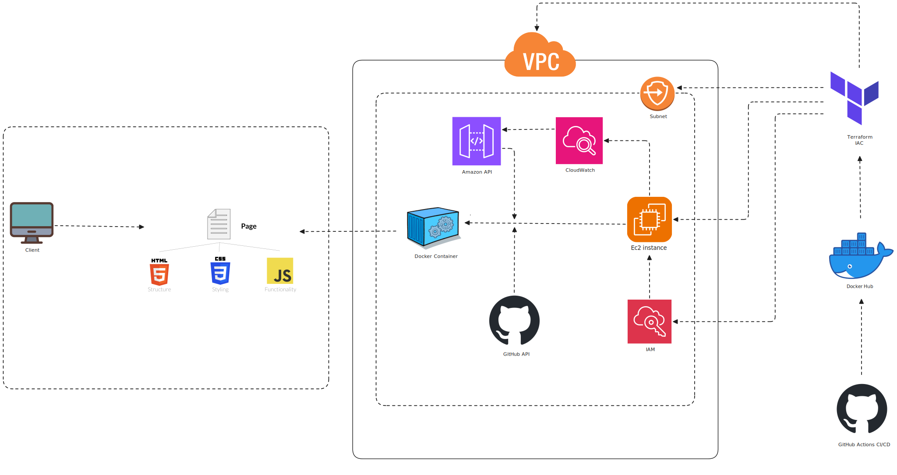

<h1 align="center">CloudPulse</h1>

<p align="center">
  <b>Real-time AWS Free Tier and GitHub Contributor Dashboard</b><br>
  <i>Monitor your AWS usage and GitHub activity at a glance.</i>
  <br><br>
  <a href="https://github.com/Asit0007/CloudPulse/actions">
    
  </a>
  <a href="https://github.com/Asit0007/CloudPulse/blob/main/LICENSE">
    
    <a href="https://github.com/Asit0007/CloudPulse" target="_blank">
    
    </a>
  <br>
</p>

---

## Architecture



CloudPulse is a lightweight dashboard to monitor AWS resource usage and GitHub contributors, deployed on AWS ECS using Terraform.  
See [docs/ARCHITECTURE.md](docs/ARCHITECTURE.md) for more details.

---

## ✨ Overview

**CloudPulse** is a lightweight web application for real-time monitoring of AWS resource usage, Free Tier limits, and GitHub repository contributors.

- Track your **AWS Free Tier usage** in real time, preventing surprise bills
- Get instant visibility into **GitHub repository contributors**
- Deploy securely on AWS using **Docker**, **Terraform**, and **CI/CD** automation

**Tech stack:** Go (backend), HTML/CSS/JS (frontend), Docker, Terraform, AWS, GitHub Actions

<p align="center">
  
  <br>
  <i>CloudPulse Dashboard - Real usage, real contributors, real simple.</i>
</p>

---

## 📦 Features

- 🟢 **Live AWS Resource and Free Tier Monitoring**: Stay within your free limits.
- 👥 **GitHub Contributors Overview**: Track open source activity for your projects.
- 🚀 **Easy Deployment**: One-click deploy to AWS ECS with IaC and GitHub Actions.
- 🐳 **Containerized & Portable**: Run locally with Docker, or scale in the cloud.
- 🔒 **Secure by Default**: Works with environment variables, secrets, IAM best practices.

---

## Table of Contents

- [Overview](#overview)
- [Features](#features)
- [Prerequisites](#prerequisites)
- [Project Structure](#project-structure)
- [Setup Instructions](#setup-instructions)
- [Configuration](#configuration)
- [Local Development](#local-development)
- [Deployment to AWS](#deployment-to-aws)
- [Usage](#usage)
- [Contributing](#contributing)
- [Security](#security)
- [Community & Support](#community--support)
- [License](#license)

---

## Features

- 📊 **Real-Time AWS Usage:** Tracks AWS resource consumption and Free Tier limits.
- 👥 **GitHub Contributors:** Visualizes contributors for your GitHub repos.
- 🛡️ **Free Tier Alerts:** Helps you avoid unexpected AWS charges.
- 🚀 **Easy Deployment:** Dockerized for quick local or cloud deployment.
- 🔒 **Secure Secrets:** Uses environment variables or GitHub Secrets for credentials.
- ⚡ **Fast & Lightweight:** Minimal dependencies, fast setup.

---

## Prerequisites

- **Go (1.21+)**: Backend server
- **Docker**: Containerization
- **Terraform (1.5.0+)**: Infrastructure automation
- **AWS CLI**: AWS interaction
- **Node.js (18+)**: (Optional) Frontend tooling
- **Git**: Version control
- **GitHub Personal Access Token**: For fetching repo data(with repo scope)
- **AWS Account**: With Free Tier

---

## Project Structure

```
CloudPulse/
├── backend/                # Go backend server
│ ├── main.go
│ ├── go.mod
│ ├── go.sum
│ └── Dockerfile
├── frontend/               # Static frontend (HTML/CSS/JS)
│ ├── index.html
│ ├── styles.css
│ ├── script.js
│ └── offline.html
├── terraform/              # Terraform IAC
│ ├── main.tf
│ └── variables.tf
└── .github/
  └── workflows/
    └── deploy.yml          # GitHub Actions CI/CD
```

---

## Setup Instructions

### 1. Clone the Repository

```bash
git clone https://github.com/Asit0007/CloudPulse.git
cd CloudPulse
```

### 2. Install Dependencies

```bash
chmod +x install_dependencies.sh
./install_dependencies.sh
```

### 3. Configure AWS CLI

```bash
aws configure
```

_Supply your AWS credentials and region (e.g. us-east-1)._

### 4. Set GitHub Token

```bash
export GITHUB_TOKEN=<your-github-token>
```

_Store securely as an env variable or GitHub Secret._

### 5. Set Up Project Structure

```bash
chmod +x setup_cloudpulse_structure.sh
./setup_cloudpulse_structure.sh
```

---

## Configuration

CloudPulse is configured via environment variables:

| Variable              | Description                                                                         | Required | Example    |
| --------------------- | ----------------------------------------------------------------------------------- | :------: | ---------- |
| `EC2_USERNAME`        | The SSH username for your EC2 instance                                              |   Yes    | `user`     |
| `AWS_REGION`          | AWS region for deployment                                                           |   Yes    | `us-east`  |
| `DOCKERHUB_USERNAME`  | Your Docker Hub username                                                            |   Yes    | `name`     |
| `DOCKERHUB_TOKEN`     | Your Docker Hub access token (create one on Docker Hub with read/write permissions) |   Yes    | `hex`      |
| `EC2_SSH_PRIVATE_KEY` | The private SSH key (contents of your .pem file)                                    |   Yes    | `AKIA...`  |
| `GITHUB_OWNER`        | Your GitHub username or organization name where the target repository resides       |   Yes    | `Asit`     |
| `EC2_HOST_IP`         | The public IP address of your EC2 instance (from Terraform output)                  |   Yes    | `91.0.0.1` |
| `GITHUB_REPO`         | The name of your project repository on GitHub                                       |   Yes    | `name`     |

_You can also use a `.env` file or pass variables to Docker/Terraform._

---

## Local Development

1. **Build and Run Locally via Docker:**

   ```bash
   cd backend
   docker build -t cloudpulse .
   docker run -p 8080:8080 -e GITHUB_TOKEN=<your-github-token> cloudpulse
   ```

2. **Access the Dashboard:**

   Open [http://localhost:8080](http://localhost:8080) in your browser.

   > **Note:** For AWS data, ensure your AWS CLI is configured and credentials are accessible to Docker.

---

## Deployment to AWS

1. **Set Up AWS Budgets:**

   Create a $0 budget and alert in AWS Console to monitor Free Tier usage.

2. **Deploy with Terraform:**

   ```bash
   cd terraform
   terraform init
   terraform validate
   terraform plan -out=tfplan
   terraform apply "tfplan"
   ```

3. **Deployment via GitHub Actions**

   Trigger Workflow: Pushing a commit will trigger the workflow

   Monitor Workflow: Go to the "Actions" tab in your GitHub repository to monitor the progress of the build and deployment. Check the logs for each step if errors occur.

4. **Access the Dashboard:**

   Verify Deployment: Once the workflow completes successfully, open your EC2 instance's public IP address in a web browser

> **Note:** Check the logs for each step if errors occur.

---

## Usage

Once deployed, CloudPulse:

- Monitors AWS resource usage and Free Tier limits.
- Shows real-time GitHub contributor stats.
- Accessible via ECS public IP.

_**Sample Output:**_


---

## Contributing

Contributions are welcome! To get started:

1. Fork the repository.
2. Create a feature branch (`git checkout -b feature/your-feature`).
3. Commit changes (`git commit -m "Add your feature"`).
4. Push to your fork (`git push origin feature/your-feature`).
5. Open a pull request.

---

## Security

If you discover a security vulnerability, please open an issue or contact the maintainer directly via email.

---

## Community & Support

- GitHub Issues: [Submit a bug or feature request](https://github.com/Asit0007/CloudPulse/issues)
- Email: [asitminz007@gmail.com](mailto:asitminz007@gmail.com)

---

## License

This project is licensed under the MIT License. See [LICENSE](LICENSE) for details.

## 📚 Further Reading & Resources

- [AWS Free Tier](https://aws.amazon.com/free/)
- [Terraform Docs](https://www.terraform.io/docs/)
- [Go Documentation](https://golang.org/doc/)
- [GitHub Actions](https://docs.github.com/en/actions)
- [Docker Hub](https://hub.docker.com/)

<p align="center">
   <b>CloudPulse &copy; 2025 | Built with ❤️ for DevOps community</b>
</p>
